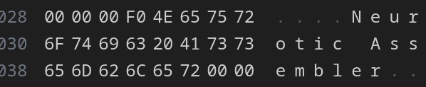

# Neurotic - An Experimental* ARM Assembler
*Experimental in this case means filled with bugs and is unfaithful in many ways to the actual ARM architecture in ways I could not forsee (or could forsee and know are problems, writing an assembler is hard)
# Features
- Compatible with my ARM Emulator, [Tranquil](https://github.com/power-emma/Tranquil)
- Reads in Assembly Code from a file, and outputs it to a valid ARM binary file
- Implements 24 (and Growing) Data Processing, Branching, and Memory Store/Load instructions
- Variable and string Support
- Indirect and direct memory support
